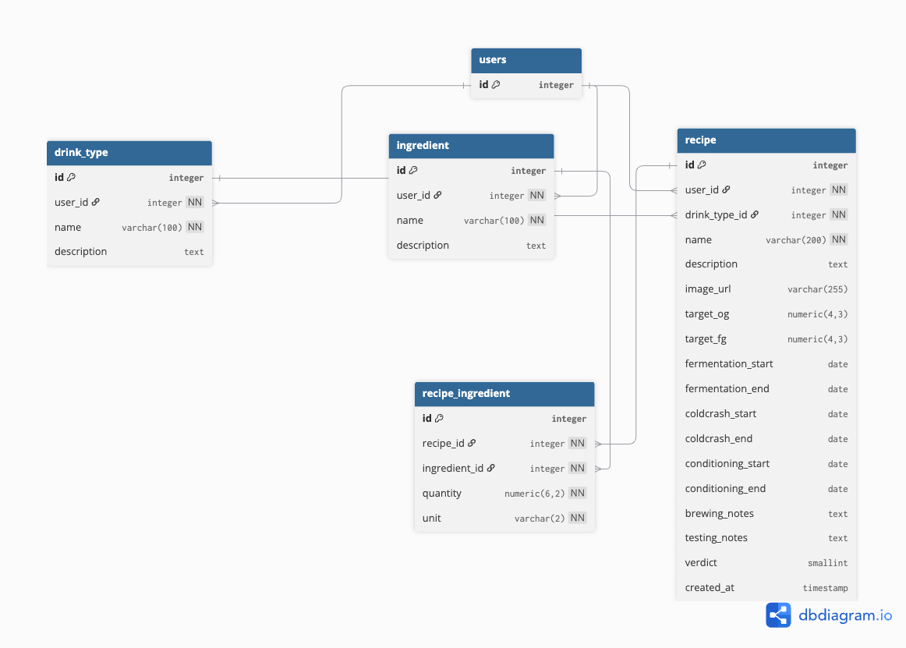

# 🍺 BrewNotes — Homebrew Recipe & Batch Tracker


## 💻  Deployment (Run Locally)

```bash
# Clone repository
git clone git@github.com:bukaro8/brewnotes_vps.git
cd brewnotes_vps

# Prepare environment
# Create .env next to docker-compose.yml (SECRET_KEY, POSTGRES_*, ALLOWED_HOSTS, etc.)

# Start containers (Django + Postgres + Caddy)
docker compose -f docker-compose.yml -f docker-compose.caddy.yml up -d --build

# Apply migrations & collect static assets
docker compose exec -T web python manage.py migrate
docker compose exec -T web python manage.py collectstatic --noinput
```


## 👥 User Stories

### 👋 First-Time User

**As a new user, I want to:**

- Sign in quickly with Google
- Create my first recipe with gravity targets
- See where to plan fermentation and add tasting notes

**Acceptance Criteria:**

- Clear "Continue with Google" on landing when logged out
- "Create Recipe" visible immediately after login
- Simple navigation with ≤ 3 main sections

---

### 🔄 Returning User

**As a regular user, I need to:**

- Jump straight to My Recipes
- Update batch notes/ratings in seconds
- Review upcoming fermentation milestones

**Acceptance Criteria:**

- Authenticated landing shows My Recipes / Create Recipe / Logout
- Edits persist without data loss
- Timeline is legible on mobile and desktop


## 🔄 Data Flow

- Browser → Caddy (HTTPS; redirects HTTP→HTTPS)

- Caddy forwards to Gunicorn (web:8000) with forwarded headers

- Django serves views/templates; WhiteNoise serves static assets

- DB reads/writes to PostgreSQL (Docker bind mount/volume)

- Google OAuth callback → /accounts/google/login/callback/


## 🛠 Tech Stack
| Technology         | Purpose                               | Version / Notes |
| ------------------ | ------------------------------------- | --------------- |
| **Django**         | Web framework                         | 4.2.x           |
| **PostgreSQL**     | Database                              | 14.x            |
| **Docker**         | Containerization                      | Compose v2      |
| **Gunicorn**       | WSGI app server                       | 21.x            |
| **Caddy**          | Reverse proxy + HTTPS (Let’s Encrypt) | 2.x             |
| **django-allauth** | Google OAuth sign-in                  | 65.x            |
| **WhiteNoise**     | Static files in production            | 6.x             |
| **Bootstrap**      | UI layout & utilities                 | 5.x             |

### Color Application

- **Header/Navbar**: Use `#5B8C3A` (Hop Green) as background with `#F8F5F0` (Off-White) text
- **Primary Buttons**: Use `#D4A017` (Malt Gold) with dark text for contrast
- **Links**: Use `#6A4C93` (Fermentation Purple) for all interactive elements
- **Cards/Forms**: Use `#D3CEC4` (Warm Gray) as border color on `#F8F5F0` (Off-White) background
- **Content Areas**: Use `#F8F5F0` (Off-White) as the primary background for content


## ✨ Features
| Feature               | Description                                | Implementation               |
| --------------------- | ------------------------------------------ | ---------------------------- |
| Google Sign-in        | One-click auth via Google                  | `django-allauth`             |
| Recipes               | CRUD recipes with OG/FG targets            | Django models/forms/views    |
| Fermentation Timeline | Plan start/end, cold crash, conditioning   | Model fields + templates     |
| Brew & Testing Notes  | Record process and tasting notes per batch | Text fields + views          |
| Ratings & Verdicts    | Mark keepers and rate each batch           | Simple rating field          |
| Static Assets (prod)  | Serve CSS/JS/images efficiently            | WhiteNoise + `collectstatic` |
| HTTPS & Reverse Proxy | Auto TLS + proxy to Gunicorn               | Caddy                        |


## 🐛 Bugs & Solutions
| Bug                       | Symptom                                | Solution                                                                                       | Impact                    |
| ------------------------- | -------------------------------------- | ---------------------------------------------------------------------------------------------- | ------------------------- |
| Static Manifest Errors    | 500 after enabling WhiteNoise manifest | Switched to `CompressedStaticFilesStorage` + re-collect                                        | Static serving stabilized |
| OAuth Redirect Using HTTP | Google “request invalid”               | Set `ACCOUNT_DEFAULT_HTTP_PROTOCOL=https`, proxy headers, Gunicorn `--forwarded-allow-ips="*"` | OAuth working in prod     |
| Port 80 Conflict          | Caddy failed to bind                   | Stopped Apache & remapped any other services                                                   | HTTPS live                |
| PgAdmin Public Exposure   | Port 80/5050 accessible publicly       | Bound to `127.0.0.1:5050` + SSH tunnel                                                         | Safer admin access        |

## Manual Testing


| Feature               | Action                              | Expected Result                         | Tested | Passed | Comments              |
| --------------------- | ----------------------------------- | --------------------------------------- | ------ | ------ | --------------------- |
| **Sign-in**           | Click “Continue with Google”        | Google consent → redirected & logged in | Yes    | Yes    |                       |
| **Create Recipe**     | Click “Create Recipe”, fill targets | New recipe appears in list              | Yes    | Yes    | Validation for OG/FG  |
| **Edit Recipe**       | Change targets/notes                | Data saved and reflected on detail      | Yes    | Yes    |                       |
| **Timeline Planning** | Add fermentation dates              | Timeline displays milestones            | Yes    | Yes    |                       |
| **Ratings**           | Rate & mark verdict                 | Rating visible in list and detail       | Yes    | Yes    |                       |
| **Static Files**      | Load landing styles/images          | No 404; cached responses                | Yes    | Yes    | WhiteNoise configured |


## Credits
### Technologies

- Django

- PostgreSQL

- Gunicorn

- Docker/Compose

- django-allauth (auth)

- Bootstrap (layout/utilities)

- Design Resources

- Palette inspired by brewing tones (hop green, malt beige, amber)

- Icons: Google Material Symbols